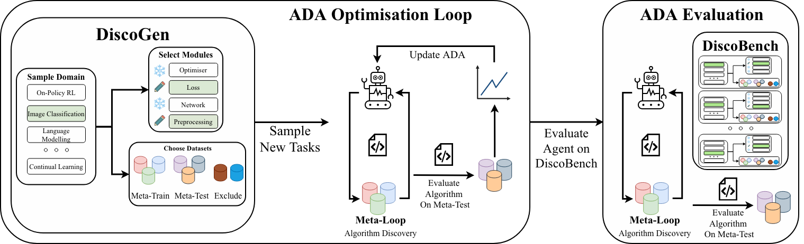

<h1 align="center">DiscoGen</h1>

<p align="center">
  <em>Procedural Generation of Algorithm Discovery Tasks in Machine Learning</em>
</p>

<p align="center">
  
</p>

<p align="center">
  <a href="https://pypi.org/project/discogen/"></a>
  <a href="LICENSE"></a>
  <a href="https://arxiv.org/abs/2603.17863"></a>
  <a href="https://AlexGoldie.github.io/discogen/"></a>
</p>

> Most ML benchmarks are static. DiscoGen procedurally generates algorithm discovery tasks across 14 domains — giving researchers a rigorous, ever-fresh testbed for automated algorithm search.

- 📄 **Paper**: <https://arxiv.org/pdf/2603.17863>
- 💻 **GitHub**: <https://github.com/AlexGoldie/discogen/>
- 📚 **Docs**: <https://AlexGoldie.github.io/discogen/>

---

## Why DiscoGen?

- **Modular by design** — each domain exposes a small set of swappable modules (loss functions, optimisers, networks, etc.), so your algorithm only needs to touch what it changes
- **Broad coverage** — 14 task domains spanning RL, vision, language modelling, Bayesian optimisation, neuroscience, and more
- **Procedurally generated** — tasks are sampled, not hand-curated, reducing overfitting to fixed benchmarks
- **Research-ready** — every domain ships with reference implementations and citations

---

## Quick Start
```bash
pip install discogen
```

List available domains:
```bash
discogen get-domains
```

Create a fully implemented reference task:
```bash
discogen create-task --task-domain OnPolicyRL
```

Create an example task with incomplete modules for an agent to fill in:
```bash
discogen create-task --task-domain OnPolicyRL --example
```

Each domain has its own dependencies (often conflicting with the base install). Use the provided `install.sh` inside the task folder to set up correctly.

See the [full documentation](https://AlexGoldie.github.io/discogen/) for detailed usage.

---

## Task Domains

| Domain | Editable Modules | Datasets | Description |
| :--- | :--- | :--- | :--- |
| 🔍 **BayesianOptimisation** | acq_fn, acq_optimizer, sampler, next_queries, surrogate, surrogate_optimizer | Ackley1D/2D, Branin2d, Hartmann6d, and 7 others | Optimising black-box functions via surrogate models |
| 🧠 **BrainSpeechDetection** | loss, networks, optim | 7 LibriBrainSherlock tasks | Detecting speech features from brain activity |
| 🖼️ **ComputerVisionClassification** | loss, networks, optim, preprocess | CIFAR10/100, TinyImageNet, OxfordFlowers, and 5 others | Image classification across diverse datasets |
| 🔄 **ContinualLearning** | optim, regularizer, replay, sampler, scheduler | PermutedMNIST, SplitCIFAR100, TinyImageNetSplit | Adapting to new data without forgetting old capabilities |
| 🌿 **GreenhouseGasPrediction** | data_processing, model | 4 Mauna Loa time-series (CO₂, N₂O, SF₆, CH₄) | Forecasting atmospheric greenhouse gas concentrations |
| 📝 **LanguageModelling** | loss, networks, optim | FineWeb, TinyStories, OPC code & math | Training transformers on code, maths, and narrative text |
| 🧹 **ModelUnlearning** | loss | MUSE, TOFU, WMDP\_Cyber | Removing specific knowledge from pretrained models |
| 🔬 **NeuralCellularAutomata** | loss, optimiser, perceive, train, update | GrowingButterfly, MNISTInpainting, and 3 others | Evolving NCA for growth, classification, and inpainting |
| 📴 **OfflineRL** | actor\_loss, critic\_loss, optim, networks, train | 10 OGBench tasks | Learning RL policies from static offline datasets |
| 🎮 **OffPolicyRL** | q\_update, policy, networks, optim, rb, train, config | 4 MinAtar | Value-based RL in MinAtar environments |
| 👥 **OnPolicyMARL** | activation, loss, networks, optim, targets, train | MABrax, MPE Spread, SMAX (17 total) | On-policy training for multi-agent environments |
| 🤖 **OnPolicyRL** | loss, networks, optim, train, activation, targets | MinAtar, Brax, Craftax (13 total) | PPO-style RL across a range of environments |
| 🚗 **TrajectoryPrediction** | loss, networks, optim, train | Argoverse2, nuScenes, Waymo | Predicting future trajectories for autonomous driving |
| 🏗️ **UnsupervisedEnvironmentDesign** | sample\_levels, train\_step, variable\_config | Kinetix (3 sizes), Minigrid | Curating training environments to improve generalisation |

---

## Development Setup

Install the environment and pre-commit hooks:
```bash
make install
```

This also generates your `uv.lock` file.

---

## Contributing

DiscoGen grows stronger with more tasks and domains — contributions are very welcome.

- **Found a bug?** [Open an issue](https://github.com/AlexGoldie/discogen/issues)
- **Want to add a domain?** See the [Contributing Guide](https://AlexGoldie.github.io/discogen/how_to/overview/)
- **Adding datasets?** See the [Dataset Integration Guide](https://AlexGoldie.github.io/discogen/how_to/dataset_integration/)

See [CONTRIBUTING.md](CONTRIBUTING.md) for full guidelines.

---

## Citation
```bibtex
@misc{goldie2026proceduralgenerationalgorithmdiscovery,
  title={Procedural Generation of Algorithm Discovery Tasks in Machine Learning},
  author={Alexander D. Goldie and Zilin Wang and Adrian Hayler and Deepak Nathani and Edan Toledo and Ken Thampiratwong and Aleksandra Kalisz and Michael Beukman and Alistair Letcher and Shashank Reddy and Clarisse Wibault and Theo Wolf and Charles O'Neill and Uljad Berdica and Nicholas Roberts and Saeed Rahmani and Hannah Erlebach and Roberta Raileanu and Shimon Whiteson and Jakob N. Foerster},
  year={2026},
  eprint={2603.17863},
  archivePrefix={arXiv},
  primaryClass={cs.LG},
  url={https://arxiv.org/abs/2603.17863},
}
```

---

## License

DiscoGen is released under the [MIT License](LICENSE).
